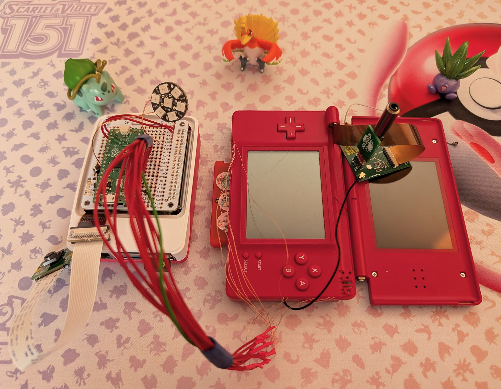

# SHAOOOH
Shiny Hunting Automaton Operating On Original Hardware

Shaooh is an automated shiny hunting bot for a DS Lite using a Raspberry Pi Pico for control.

The code mostly works, but only has a limited set of scenarios to hunt in, and the hardware isn't pretty. It's not intended to
try to catch shinies, but waits for manual input at that stage.

## Credits and References

* DS Lite TV Out Mod from [Digigu Mods](https://dsdigigumods.com/)
* DS Lite button pinout from [Acidmods](https://www.acidmods.com/moddedmatt/dslight%20pinout.jpg)

