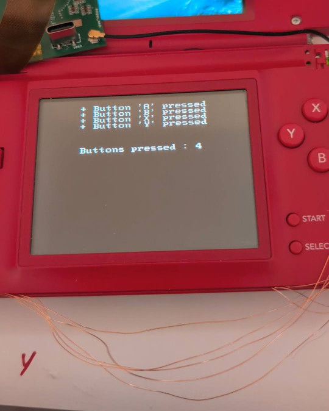
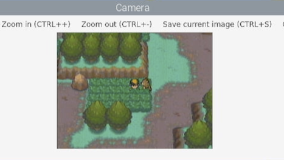
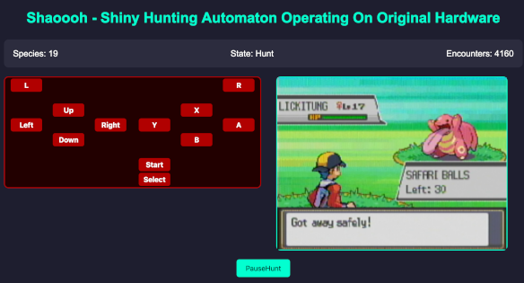
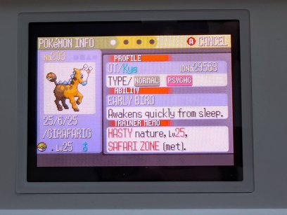

# SHAOOOH
Shiny Hunting Automaton Operating On Original Hardware

## Starting the project

The inspiration for this project was seeing a couple of shiny hunting bots that others had developed,
such as [Geeze](https://www.youtube.com/watch?v=RWD_BJTCBSQ) and [someone at 2024 Worlds](https://youtu.be/okXRykQ3r1c?si=-1oZ1OHnAKpFP0tY&t=2508) in AbsolBlogsPokemon's video.

Doing some research showed that [a team had found TV out functionality](https://github.com/LNH-team/Lost-NDS-TV)
in the DS Lite, and [others had worked on modifying the DS Lite's buttons](https://facelesstech.wordpress.com/2022/07/23/ds-lite-clicky-buttons/).
[Digigu Mods](https://dsdigigumods.com/) produces boards that can make use 
of the DS Lite's TV out functionality.

## First Steps

The first thing to implement was being able to control the DS Lite from a
microcontroller. This involved
[taking the DS Lite](https://www.ifixit.com/Device/Nintendo_DS_Lite) apart
and soldering enamelled/magnet wire to the test points for each button, as
well as ground.

In order to try and ensure all the buttons were working and the DS didn't
need to be taken apart more times than necessary, longer lengths of magnet
wire than needed were soldered to each test point. Each wire was labelled
with the button it was connected to. Once all the wires were connected,
each wire was manually touched to ground to ensure it worked to trigger
a button press.

After all the buttons were connected up, the magnet wire was cut down
to size and lengths of regular wire connected to them. One by one these
were connected to a Raspberry Pi Pico.

It was important to ensure that the microcontroller would either be
disconnected from the wires connected to the DS or connect the button
to ground. The DS buttons have a pull-up resistor so then when unpressed
they are read at the DS voltage, if the microcontroller was to drive this
to a high value the voltage supply of the microcontroller would then be
driven to the DS via the pull-up resistor which could cause problems if
there was any difference in the voltage.

The `Pin.OPEN_DRAIN` mode in MicroPython was used to implement this behaviour.
Writing a value of 1 to the pin would leave the pin in a high-impedance
state and so the pull-up resistor in the DS would keep the button read
as unpressed. Writing a value of 0 to the pin would connect it to ground
(overriding the pull-up resistor) and so the DS would read the button as pressed.

Some testing of the script later, and the buttons could be pressed via software. The microcontroller would listen for commands over a serial
connection, and the change the state of the pins as requested.

## Capturing the Screen

After implementing control of the DS, a mechanism was needed to capture
the screen output so that the controlling software could determine what
state the game was in, to decide what action to take and check if a
shiny had been found.

The TV out mod for the DS is connected between the motherboard and the top
screen. It then has a headphone jack to provide the video out over a 3.5mm
to RCA cable. Initially no video could be seen but some checking of the
cable and a [helpful Reddit post](https://www.reddit.com/r/raspberry_pi/comments/oo46ih/i_mapped_a_few_trrs_cables_to_the_rca_connectors/)
showed that there wasn't a standard cable for this and after buying a new
cable it came with an adapter that finally showed video out.

## Image Recognition

Next software needed a way to tell what was going on in the game. [OpenCV](https://opencv.org/)
was used for this, using the python bindings for initial prototyping.

The initial testing was done with a loop that fetched a frame from the capture device and
then on a keypress did template matching against sprites to determine which species was
encountered. Despite matching the template in greyscale only, it also did a good job of
determining if the sprite on-screen was a shiny or not.

The python testing script was also used to prototype detection of on-screen features, such
as HP bars to determine when a battle was started and ready for inputs.

Comparison of colour histograms was tested to compare the colours on the screen against the
shiny and normal colours, but this turned out to not be reliable as the capture card did not
exactly match the reference shiny and so differences in brightness could result in incorrect
results. Due to this, the template matching against a shiny reference sprite and the delay to
enter battle was used as the shiny detection metric. (The shiny sparkle animation causes a
delay which can be used to distinguish shinies).

## Control

In order to allow starting and stopping a hunt, as well as tracking the progress, a web
interface was written in Rust using Axum. This provided a simple interface to press DS
buttons and start or stop hunts.

The Rust code has the following modules:

* Web API using Axum, to retrieve the state and allow control
* A 'Vision' module to handle fetching frames from a capture device and running the image detection
* A 'Hunt' module to run through the states of entering a battle or soft-resetting.

## State Machines

Each hunt is implemented as a FSM that defines the steps to go through in the sequence of getting
another encounter, or to the next soft-reset. Each state can either progress immediately to the
next state, wait for a specified delay or choose the next state based on features in the captured
image.

For example, a sequence to test random encounters could be something like:

* `TryGetEncounter`, spin the character until the start of an encounter is detected (screen goes black)
* `WaitEncounter`, wait until the bottom text bar appears
* `WaitEncounterReady`, wait until health bars are shown
* `Detect`, check which species was encountered, and if it was shiny
* `Run`, press the buttons to leave the encounter

The delay between `WaitEncounter` and `WaitEncounterReady` can be used
to determine if the shiny sparkle animation played.

Ideally, these sequences would be composable and possible to define at a higher level. Currently
to leave an encounter it needs multiple states, e.g. `Run1PressDown` -> `Run2PressRight` -> `Run3PressA`. This makes the state machines overly verbose and takes more effort to adapt to
a new scenario.

## Shinies

Initially, I set the bot going trying to find a shiny starter in a Japanese copy of Fire Red.
The first attempt got over 10k soft-resets, and the actual number is a bit unknown as at one
point the DS was not plugged in to charge overnight and so turned off during the hunt.

Also, it seemed possible that by having inputs at a fixed delay it was hitting some periodic
effect with the Gen III random number generation and it was possible that all shiny frames were
being skipped over. Some randomness was added but, it was then [Safari Week 2025](https://www.youtube.com/watch?v=IqlPwUh_n-0)...

Initally the bot was set going in the Hoenn safari zone, but not learning previous lessons there was
no randomness between attempts. Although the number of encounters was not implausible without
finding anything the sequence was updated to add more randomness and set going again.

After 15066 encounters a shiny Girafarig appeared, although it was in the early hours of the morning
so it wasn't caught until some time later. Luckily, [it was caught with the first ball](https://www.twitch.tv/shaooohbot/clip/JollyBoredPelicanYouDontSay-SevGiibMjVzACiqn).

The bot was set going again and after another 4773 encounters an Oddish had appeared. Continuing the
lucky streak, [it was caught first try](https://www.twitch.tv/shaooohbot/clip/AbnegateGlamorousCaribouPlanking-emTn-h-BfploJa_b). And when checking the party afterwards, all
had Pokérus, which I'd never encountered before.

...and that's Shaoooh :star2:

## 3DS Support

The same general process can be used to hunt shinies in a 3DS using NTR to capture the screen
and InputRedirection for control. These require sockets to be created to communicate with the
3DS, and these then interact with the existing methods of perfoming image processing and
sending button presses.

Matching sprites isn't as feasible in the 3D games, so instead the approach used is to match
on the shiny star at the start of an encounter, at least for Ultra Sun and Ultra Moon which
is the first game logic is implemented for.
